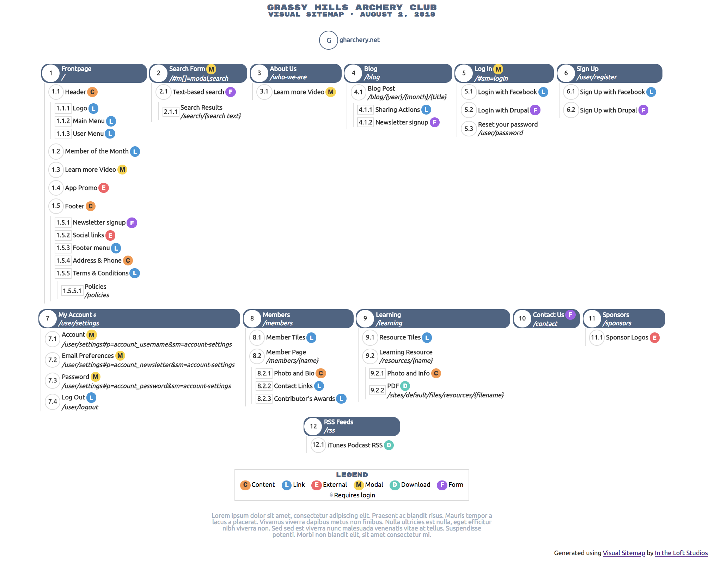

# Visual Sitemap

## Summary

Using a very simple JSON file schema to define the structure of your website, this project uses that structure to generate a beautiful, visual HTML sitemap.  The final document has all icons and CSS embedded in it and can be shared with other team members easily.  The primary fonts use Google Fonts and require internet access, however the fallback fonts work just fine offline.

Take a look at _example.json_ to see what a definition file looks like.

Open _example.html_ in a browser to see the example visual sitemap.

**Visit <https://aklump.github.io/visual_sitemap> for full documentation.**

## Quick Start

- Once you've installed _vismap_, create a new data file thus `vismap {FILENAME}.json -c`
- Replace the contents of that file with real content.
- In Terminal type `vismap {FILENAME}.json` to compile the sitemap.
- Open _{FILENAME}.html_ in a browser.

## Requirements

1. You will need [Composer](https://getcomposer.org/doc/00-intro.md#installation-linux-unix-osx) for installing.
1. You will need a text editor to edit JSON files.
1. You will need a command line terminal to generate the map.

## Contributing

If you find this project useful... please consider [making a donation](https://www.paypal.com/cgi-bin/webscr?cmd=_s-xclick&hosted_button_id=4E5KZHDQCEUV8&item_name=Gratitude%20for%20aklump%2Fvisual_sitemap).

## Installation

### Install Globally Using Composer

To be able to use the commands from any directory in your CLI you may want to install this globally.

    composer global require aklump/visual-sitemap

Make sure you have the composer bin dir in your `PATH`. The default value is _~/.composer/vendor/bin_, but you can check the value that you need to use by running `composer global config bin-dir --absolute`.
    
To check this you must open _~/.bash_profile_ (or _~/.bashrc_); you're looking for a line that looks like the following, if you can't find, you'll need to add it.
                                 
    export PATH=~/.composer/vendor/bin:$PATH

### Install Per Project Using Composer

    cd /your/project/folder
    composer require aklump/visual-sitemap

### Testing installation    

1. Test your installation by typing `vismap` in your terminal, you should see:

        Argument 1 must point to a configuration json file.

## Usage

1. Create the configuration JSON file following the schema.  Use _example.json_ and _quick_start.json_ as guides.  If you wish to use the CLI to create the file (which copies and renames _quick_start.json_) do the following:
        
        cd /the/dir/to/contain/the/config
        vismap FILENAME.json -c
        
1. You can also refer to _schema.json_, which uses [JSON Schema](https://spacetelescope.github.io/understanding-json-schema/index.html) to define the format of the configuration file.
1. Generate an HTML version once by running the following command: `vismap sitemap.json`.  _sitemap.html_ will be created.  If _sitemap.html_ already exists, you will need to use the `-f` flag to overwrite it, e.g. `vismap sitemap.json -f`.
1. A file watch command is availabe.  As you make changes to the JSON file, the sitemap will automatically be re-generated.  Use `vismapwatch sitemap.json` for this.  Again, use the `-f` flag if the HTML file already exists.
1. Use the `--out={filepath}` to control the output location **relative to the source file**.  You may also use an absolute path beginning with a `/`.

### As JSON

You can export your sitemap as JSON using `--format=json`.  Note: the extension used will be `.compiled.json`

    vismap example.json -f --format=json

### As Text List

You can export a list of sections and titles using  `--format=list`

### Best Practices

1. Do not change the order of items in the JSON file, unless you intend to change the section numbers associated with the items.  That is to say, always append new items to the end of a section array.  Failure to follow this point will result in your section numbers being reassigned to different sections.
